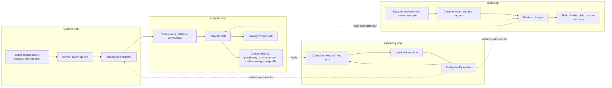

# Workflows & Feedback Loops

The seed isn't a static file structure — it's a set of **loops** that pump information from operational reality into stable knowledge, and from stable knowledge back into operational behavior. This doc maps the loops so you can see how the pieces connect.

If [`PHILOSOPHY.md`](PHILOSOPHY.md) is the *why*, this is the *how the parts move*.

---

## The four primary loops

The four loops aren't independent — they cross-pollinate continuously. The sections below trace each loop end-to-end.

---

## Loop 1: Capture — observation → staging

**Trigger:** something noteworthy surfaces in a client conversation, strategic prep session, or substantive engagement moment.

**Steps:**

1. **Notice.** A reframe lands. A buyer uses language you've never heard before. You catch yourself doing something that worked. A pattern recurs across two engagements.
2. **Stage, don't integrate-immediately.** Invoke [`harvest-learnings`](.claude/skills/harvest-learnings/SKILL.md): *"harvest learnings from <engagement>."* The skill reads engagement artifacts, cross-references existing canonical, and writes a dated doc to [`Strategy/to integrate/`](Strategy/to%20integrate/).
3. **Don't push to canonical yet.** N=1 insights look transferable but often aren't. The doc lives in staging until corroborated or until the next intentional integration pass.

**Why staging exists:** it's the gap between *"this looks important"* and *"this should drive operating decisions."* Most insights need at least one second engagement (or one quiet review) before they earn canonical weight.

**What you're guarding against:** continuous-edit drift in canonical docs. Without staging, every new conversation's energy bleeds into the strategy summary and the strategy becomes whatever you talked about most recently.

**Anti-patterns:**
- Skipping staging because *"this one's obviously right"* — almost always the moment to slow down
- Treating staging as a junk drawer — every staged doc should have a "where this should integrate" target table
- Letting staging accumulate indefinitely without integrate passes (see Loop 2)

---

## Loop 2: Integrate — staging → canonical → archive

**Trigger:** you've decided a staged doc is ready (corroborated by another engagement, or after time + reflection has confirmed the pattern).

**Steps:**

1. **Invoke `integrate`.** [`integrate`](.claude/skills/integrate/SKILL.md) reads the staged doc, reads the target canonical docs named in its "Where this should integrate" section, and proposes a per-edit plan in chat.
2. **Approve per-edit, not per-batch.** Each proposed edit gets its own approval. You can approve some, defer others, reject some, run preview-only. *No silent writes to canonical.*
3. **Apply approved edits surgically.** The skill writes them, refreshes "Last Updated" fields, and confirms in chat.
4. **Archive the source.** The staged doc moves to [`Strategy/z-archived/`](Strategy/z-archived/) with an integration header naming where its content went. The trail isn't lost; the staging area stays clean.

**Why this loop exists:** canonical docs are load-bearing. Strategy + positioning + evidence ledger drive how you describe your work, what you commit to, what you measure. They deserve the friction of explicit human approval per edit.

**Anti-patterns:**
- Bulk-integrating without reviewing each edit ("approve all" without reading)
- Skipping the archive step — leaves the staging area cluttered and confuses future harvest cross-references
- Re-integrating an already-integrated doc (the skill checks for this; honor the warning)

---

## Loop 3: Operating — plan → execute → retro

**Trigger:** Monday morning of a new week.

**Steps:**

1. **Plan v1.** Open `Container/week-of-YYYY-MM-DD.md` (or copy `Container/week-of-TEMPLATE.md` to the right filename). Fill in the day-by-day blocks, the cadence items, the explicitly-not-doing list. **Don't iterate to perfection** — ship a v1 in 15 minutes and learn from what actually happens.
2. **Execute through the week.** The plan is reference; reality wins. If something shifts, capture it in the plan as you go (don't wait for retro).
3. **Friday retro (the keystone).** Walk the plan's measurement rules. Did the keystone cadence happen? Were drift signals firing? What surfaced that wasn't in the plan? Anything strategy-relevant gets staged via Loop 1.
4. **Adjust, don't rewrite.** Next week's plan should be *small adjustments* to this week's, not a fresh start. Adjustment-discipline is itself a cadence.

**The keystone cadence:** `Friday weekly review of the Evidence Ledger`. This single ritual holds the entire system honest. If it skips two weeks in a row, every other discipline is at risk. The [`scaffold-cadence`](.claude/skills/scaffold-cadence/SKILL.md) skill helps install it, and it should be the *first* operational ritual you commit to.

**Why this loop exists:** strategy without an operating layer becomes doc-in-drawer. The weekly plan + Friday retro is the smallest viable container for keeping strategy and operations in conversation.

**Anti-patterns:**
- Letting Friday slip "just this once" — the second skip kills the install
- Filling the retro 5 minutes before EOW without reflection — defeats the purpose
- Adding more cadences before the first is sticky (4-week rule per [`scaffold-cadence`](.claude/skills/scaffold-cadence/SKILL.md))

---

## Loop 4: Truth — outcome → evidence → claim retire/refine

**Trigger:** an engagement closes (won or lost), a surprise occurs, or a counter-example surfaces.

**Steps:**

1. **Forensic** (~30–60 min). For each meaningful close: what was the forcing event? Smallest commitment that unstuck it? Channel? Did our positioning land in their words? What did they think they were buying vs. what they actually bought?
2. **Add evidence rows.** For each pattern surfaced, add a `SUPPORTS` / `CONTRADICTS` / `NEUTRAL` row to the relevant claim in [`Strategy/evidence-ledger.md`](Strategy/evidence-ledger.md).
3. **Update the level.** A claim with more recent supporting cases moves up (L1 → L2 → L3 → L4). A claim with strong contradictions moves down or gets retired.
4. **If a claim is retired:** move its section to the `## Retired claims` table at the bottom of the ledger with a one-line reason. Don't delete — the reasoning trail matters when the same idea resurfaces in 6 months.
5. **Cross-check `strat-summary.md`.** If a retired claim was driving operating decisions in the strat summary, that section needs an update — usually surfaced in the next Friday review.

**Why this loop exists:** strategic claims drift toward what feels right. Without an explicit falsification mechanism, the strategy gradually decouples from operating reality and you don't notice until something breaks. The Evidence Ledger is the answer to *"how do you know this is still true?"*

**Anti-patterns:**
- Forensic only on losses — wins are equally diagnostic, often more so
- Adding only `SUPPORTS` rows (confirmation bias) — actively look for `CONTRADICTS`
- Treating "no contradictions in 3 months" as confirmation — sometimes it just means you haven't tested
- Skipping forensics because the close was "obvious" — the obvious ones often have the highest information value

---

## Cross-loop interactions (where the magic happens)

The four loops aren't sequential. They feed each other constantly:

| When this happens... | ...trigger this loop |
|---|---|
| Friday retro surfaces a recurring pattern | Loop 1 (stage as a learning) |
| A staged doc gets corroborated by a second engagement | Loop 2 (integrate to canonical) |
| Loop 2 adds a new evidence row | Loop 4 may need to update the level |
| Loop 4 retires a claim that drove a strategic decision | Loop 3 next week's plan adjusts |
| Loop 3's "what surfaced" section is rich | Loop 1 catches it |
| Canonical positioning shifts (Loop 2) | Loop 3 next week's framing reflects the shift |

The healthiest operating state is when **all four loops are running quietly in parallel**. None of them are dramatic; together they're how strategy stays alive.

---

## How the skills map to loops

| Skill | Primary loop | Notes |
|---|---|---|
| [`harvest-learnings`](.claude/skills/harvest-learnings/SKILL.md) | Loop 1 | The capture mechanism |
| [`integrate`](.claude/skills/integrate/SKILL.md) | Loop 2 | The integration mechanism with approval gates |
| [`scaffold-cadence`](.claude/skills/scaffold-cadence/SKILL.md) | Loop 3 | Installs the keystone (and others, one at a time) |
| [`gain-analysis`](.claude/skills/gain-analysis/SKILL.md) | All loops | Asked before any custom build that would augment any loop |
| [`discover-stack`](.claude/skills/discover-stack/SKILL.md) | Setup | Before any loop runs — establishes what's already in place |
| (your AI in chat) | Setup | Walks the OnboardingChecklist on demand — no dedicated skill needed |

**Loop 4 has no dedicated skill yet.** The forensic protocol lives in `Strategy/evidence-ledger.md.template` § "Recent closes / losses are unmined data." If forensics become recurring enough, that's a candidate for a future `engagement-forensic` skill.

---

## Health check (and what to do when a loop breaks)

The Friday review is the natural slot to scan these signals.

| Loop | Healthy | Unhealthy | Fix when broken |
|---|---|---|---|
| 1. Capture | Staging has 1–4 items | Empty for >1 month, OR >10 items | Empty: when something feels significant in a conversation, stop and stage it. Overflowing: schedule a monthly integrate pass. |
| 2. Integrate | Canonical touched in the last quarter | Canonical untouched for 3+ months | Run `integrate` on the oldest staged doc. Don't batch — one source per session. |
| 3. Operating | Friday retro happens without prompting | Skipped twice in a row | Re-install the keystone; cut duration to 15 min if 30 is too much. Cadence > content. |
| 4. Truth | At least one claim level changed (up or down) in the last quarter; at least one retired claim exists | Every claim L4, no retired claims after 6 months | Trigger forensics on engagement-close, not on schedule. Every won or lost engagement = mandatory 30-min forensic. |

If you go more than ~3 weeks without a Friday review, run [`gain-analysis`](.claude/skills/gain-analysis/SKILL.md) on whatever's been displacing it — chances are it's a build that wasn't actually worth it.

---

## Closing

Workflows aren't policies — they're patterns the system tends to fall into when operated well. The seed gives you the artifacts, the skills, and the cadence scaffolding. The loops are what you actually live in.

The most reliable indicator the system is working: **all four loops are running, none are dramatic, and you can name the most recent revolution of each one.**
